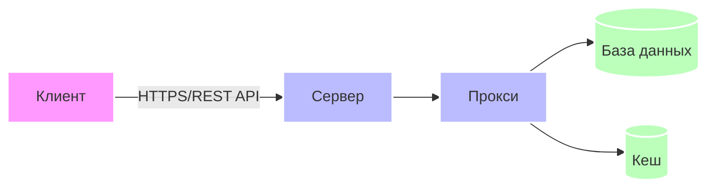
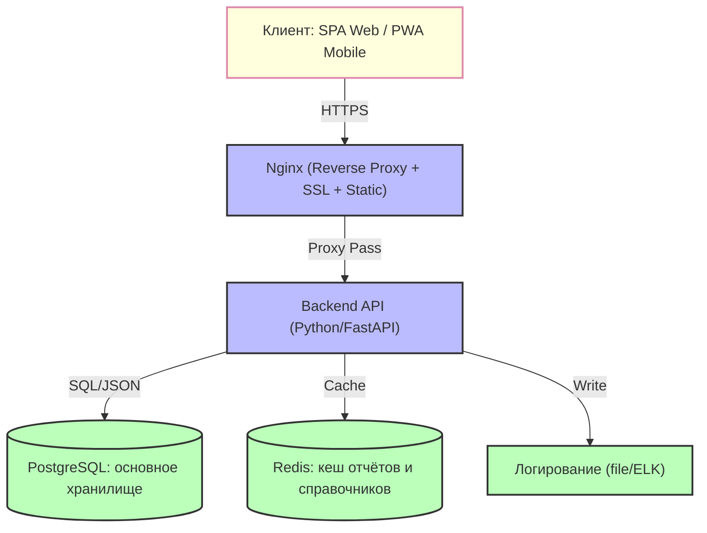

# Лабораторная работа №8. Проектирование архитектуры информационной системы SportCity

## Раздел 1 — Выбор архитектурного стиля

### Выбранный стиль: **Клиент–сервер (трёхзвенная веб-архитектура)**

### Верхнеуровневая схема системы:

**Компоненты:**
- **Клиент**: Веб-браузер / Мобильное приложение (PWA)
- **Сервер**: Nginx + Backend API
- **База данных**: PostgreSQL
- **Кеш**: Redis

### Обоснование выбора:

**1. Почему клиент–сервер подходит для SportCity:**

Предметная область предполагает **множество ролей** с разными правами доступа:
- Администрация города (Спорткомитет) — аналитика и отчётность
- Руководители спортивных организаций — управление секциями
- Тренеры — доступ к данным спортсменов
- Спортсмены — просмотр расписания и результатов
- Медицинская служба — контроль допусков
- Техническая служба — учёт состояния объектов

Всем им нужен **единый источник истины**. Клиент–серверная архитектура позволяет:
- Вынести бизнес-логику на сервер (проверка меддопусков, валидация разрядов, правила проведения соревнований)
- Обеспечить централизованное хранение данных о спортивной инфраструктуре
- Поддерживать 13 типов аналитических запросов из ТЗ
- Гарантировать консистентность данных при одновременной работе множества пользователей

**2. Почему отказался от альтернатив:**

**Монолит (толстый клиент / десктопное приложение):**
- ❌ Не подходит, т.к. системе нужен **кроссплатформенный доступ**: тренеры работают с планшетов на стадионах, спортсмены проверяют расписание с телефонов, администрация — с рабочих компьютеров
- ❌ Проблемы с **синхронизацией данных**: при изменении расписания соревнований все клиенты должны мгновенно получить обновление
- ❌ Сложность **централизованных обновлений**: при изменении правил учёта разрядов придётся обновлять каждое рабочее место

**Микросервисы:**
- ❌ **Overengineering** для данного масштаба: команда разработки 1–3 человека, нагрузка < 10 RPS
- ❌ **Сильная связанность домена**: спортсмен ↔ клуб ↔ тренер ↔ вид спорта ↔ соревнование ↔ результат ↔ меддопуск. Разделение потребует распределённых транзакций и sagas
- ❌ **Избыточная сложность**: для учебного проекта и городской системы с умеренной нагрузкой микросервисы только замедлят разработку

**3. Минусы клиент–серверной архитектуры и стратегии жизни с ними:**

| Минус | Стратегия минимизации |
|-------|----------------------|
| **Единая точка отказа backend** | Stateless-архитектура, health-checks, автоматический рестарт через systemd/docker, регулярные бэкапы БД |
| **Рост монолита усложняет поддержку** | Строгая модульная структура (разделение по доменам: athletes, competitions, facilities), CI/CD с автотестами |
| **Пиковые нагрузки в период регистрации на соревнования** | Redis-кеширование справочников и тяжёлых отчётов, connection pooling в БД |

**4. Условия перехода на микросервисы:**

Переход на микросервисную архитектуру целесообразен при:
- **DAU > 15 000** (расширение на область/регион)
- **Появлении offline-режима** в мобильных приложениях (синхронизация результатов с полей)
- **Необходимости независимого масштабирования** модуля генерации отчётов в период городских спартакиад
- **Интеграции с внешними системами** (федерации спорта, медицинские реестры) через event-driven архитектуру

В этом случае выделяются:
- `competition-service` (управление соревнованиями)
- `athlete-service` (учёт спортсменов и меддопусков)
- `facility-service` (учёт объектов)
- `report-service` (генерация аналитики)

---

## Раздел 2 — Компоненты системы

### Детальная архитектурная схема:

### Описание компонентов:

| Компонент | Что делает | Почему нужен именно в SportCity |
|-----------|------------|--------------------------------|
| **Клиент (SPA Vue.js)** | Отображает интерфейсы для разных ролей (администрация, тренеры, спортсмены), отправляет REST-запросы, кеширует статику | Спортсменам и тренерам нужен доступ с мобильных устройств на стадионах. SPA обеспечивает реактивность при работе с таблицами результатов и расписанием без перезагрузки страницы. PWA позволит работать offline при плохом интернете на выездах |
| **Backend API (FastAPI)** | Принимает запросы, валидирует данные, выполняет бизнес-логику: проверка меддопусков, расчёт статистики, агрегация отчётов, валидация разрядов | Вся логика из ТЗ должна исполняться централизованно:  • Проверка: "спортсмен состоит только в одном клубе" • Валидация: "соревнование проводится по одному виду спорта" • Правила: "медсправка действительна X дней" Без централизации возникнут аномалии данных |
| **PostgreSQL** | Хранит все сущности: спортсмены, тренеры, клубы, сооружения, соревнования, результаты, медосмотры, награды | Данные **строго реляционные** с множеством связей: • athlete ↔ club (1:1) • athlete ↔ sport (M:N) • athlete ↔ coach (M:N) • competition ↔ facility (1:1) Нужны **транзакции (ACID)** при регистрации на соревнования и фиксации результатов. **JSONB** нужен для специфических атрибутов сооружений (вместимость стадиона, тип покрытия корта) |
| **Nginx** | Reverse proxy, SSL-терминатор, отдача статики фронтенда, балансировщик (на перспективу) | Защищает API от прямых запросов, кеширует статику (логотипы, CSS, JS), распределяет трафик при пиковых нагрузках (массовая регистрация на городские соревнования). SSL обязателен для защиты персональных данных (152-ФЗ) |
| **Redis** | Кеш результатов тяжёлых аналитических запросов (13 типов выборок из ТЗ), справочников (виды спорта, типы сооружений, разряды) | В период отчётности администрация многократно запрашивает одни и те же данные: "список спортсменов по виду спорта", "соревнования за период". Без кеша БД будет перегружена. Кешируем только READ-операции с TTL 15 мин, инвалидируем при изменении данных |
| **Логирование** | Журналирование действий пользователей (кто, когда, что изменил) | Требование из ТЗ: "журналирование действий пользователей". При удалении спортсмена или изменении результата必须知道 кто это сделал. ELK (опционально) для удобного поиска по логам |

### Почему не добавлены другие компоненты:

| Компонент | Почему не нужен |
|-----------|----------------|
| **Брокер сообщений (RabbitMQ/Kafka)** | Все процессы в SportCity **синхронные**: регистрация на соревнование → мгновенная проверка меддопуска → подтверждение. Асинхронность потребуется только при внедрении email-рассылок о расписании или очереди генерации PDF-отчётов |
| **CDN** | Система используется в пределах одного города, статика не требует глобальной доставки. Nginx справляется с отдачей статики |
| **Read Replica БД** | Нагрузка < 10 RPS, один экземпляр PostgreSQL справится. Read-реплика нужна при DAU > 10 000 и множестве аналитических запросов |
| **Elasticsearch** | Полнотекстовый поиск не требуется. Достаточно LIKE-запросов в PostgreSQL для поиска спортсменов по ФИО |

---

## Раздел 3 — Оценка нагрузки

### Исходные данные (реалистичные для среднего города):

| Параметр | Значение | Обоснование |
|----------|----------|-------------|
| **Спортивных организаций** | ~50 | Город среднего размера |
| **Спортсменов** | ~5 000 | 50 организаций × 100 спортсменов |
| **Тренеров** | ~500 | 50 организаций × 10 тренеров |
| **Администрации (Спорткомитет + руководители)** | ~100 | Городская администрация + директора |
| **Рабочих дней в году** | ~250 | Учебно-тренировочный год + соревнования |

### 1. DAU (Daily Active Users) с разбивкой по ролям:

| Роль | Всего | Активность | DAU |
|------|-------|------------|-----|
| **Спортсмены** | 5 000 | 20% проверяют расписание/результаты | 1 000 |
| **Тренеры** | 500 | 80% ведут учёт групп, фиксируют результаты | 400 |
| **Администрация/руководители** | 100 | ~100% в рабочие часы | 100 |
| **Итого DAU** | | | **≈ 1 500** |

### 2. Действия на пользователя в день (Read / Write):

| Роль | Чтение (запросов/день) | Запись (запросов/день) | Примеры |
|------|------------------------|------------------------|---------|
| **Спортсмен** | 3 (расписание, результаты, личный профиль, допуск) | 0.5 (обновление профиля, загрузка документов) | Просмотр ≠ изменение |
| **Тренер** | 5 (состав группы, расписание, результаты подопечных, справочники) | 4 (внесение результатов, регистрация на соревнования, обновление меддопусков) | Ввод протокола = транзакция |
| **Администрация** | 10 (аналитические отчёты, списки организаций, статистика) | 2 (создание соревнований, назначение организаторов) | 13 типов запросов из ТЗ |

**Средневзвешенная нагрузка:**
- **Read**: `(1000×3 + 400×5 + 100×10) = 6 000 / 1500 = 4` запроса/DAU
- **Write**: `(1000×0.5 + 400×4 + 100×2) = 2 300 / 1500 ≈ 1.5` запроса/DAU

### 3. RPS (Requests Per Second) — расчёт:

**За день:**
- Read: `1 500 × 4 = 6 000 запросов`
- Write: `1 500 × 1.5 = 2 250 запросов`

**Активные часы:** 10 часов (08:00–18:00) = 36 000 секунд

| Тип | Средний RPS | Пиковый RPS (×3) | Характер нагрузки |
|-----|-------------|------------------|-------------------|
| **Read** | 6 000 / 36 000 ≈ **0.17** | **~0.5 RPS** | Лёгкие SELECT, часто с кешем Redis |
| **Write** | 2 250 / 36 000 ≈ **0.06** | **~0.2 RPS** | Транзакции с валидацией (меддопуск, регистрация) |

**🔑 Ключевой вывод:** 73% нагрузки — чтение, 27% — запись. Это определяет стратегию: **агрессивное кеширование** аналитических отчётов + **строгая консистентность** при записи (транзакции).

### 4. Объём данных:

| Тип | Размер | Расчёт | Итого/день | Итого/год |
|-----|--------|--------|------------|-----------|
| **Read-ответ** | ~3 KB (сжатый JSON) | 6 000 × 3 KB | 18 MB | ~4.5 GB (не храним) |
| **Write-запрос + аудит** | ~5 KB (тело + лог изменений) | 2 250 × 5 KB | 11.25 MB | ~2.8 GB |
| **Всего** | | | **~29 MB/день** | **~7.3 GB/год** + индексы/бэкапы → **~15 ГБ/год с запасом** |

**Детализация хранимых данных:**
- Спортсмены: 5 000 × 1 KB = 5 MB
- Тренеры: 500 × 1 KB = 0.5 MB
- Соревнования: 500/год × 2 KB = 1 MB/год
- Результаты: 10 000/год × 500 байт = 5 MB/год
- Медосмотры: 5 000/год × 1 KB = 5 MB/год
- **Итого "чистых" данных**: ~50 MB (без учёта истории и индексов)

### 5. Вывод по масштабированию:

**Read-нагрузка (0.5 RPS пик):**
- Легко покрывается **одним экземпляром API + Redis** (TTL 15 мин для отчётов)
- PostgreSQL справляется с тысячами SELECT/сек

**Write-нагрузка (0.2 RPS пик):**
- Один сервер PostgreSQL справляется с запасом (транзакции короткие <50 мс)
- Конфликты редки (разные тренеры → разные спортсмены)

**✅ Горизонтальное масштабирование НЕ требуется.** Достаточно:
- **Вертикального резерва**: 2 vCPU / 4 GB RAM (с запасом на рост)
- **Read-реплики БД** — только если время отклика отчётов >2 сек в период отчётности
- **Шардирование** — при расширении на область (DAU > 10 000)

**Достаточно одного сервера** (или VPS) с Docker Compose для развёртывания всех компонентов.

---

## Раздел 4 — Выбор стека технологий

| Слой | Что выбрано | Обоснование (под задачу SportCity) | Альтернатива и причина отказа |
|------|-------------|-----------------------------------|-------------------------------|
| **Бэкенд** | **Python + FastAPI** | • **Async I/O** критичен для одновременной обработки запросов от множества пользователей в период регистрации • **Pydantic** обеспечивает строгую валидацию данных: проверка дат соревнований, валидация разрядов, контроль меддопусков • **Автоматическая генерация OpenAPI** упрощает интеграцию с фронтендом и мобильным приложением • **Быстрая разработка**: для учебной команды 1–3 человека скорость важнее микрооптимизаций | **Java/Spring Boot**: избыточная сложность, тяжёлый memory footprint для <1 RPS **Node.js/Express**: слабая типизация без TypeScript, сложнее валидировать доменные правила (меддопуски, разряды) **Django**: избыточный "batteries-included" фреймворк, тяжелее FastAPI |
| **База данных** | **PostgreSQL 15+** | • **Реляционная модель** идеально подходит для связанных сущностей: athlete ↔ club ↔ coach ↔ competition • **ACID-транзакции** критичны при регистрации на соревнования (проверка квот → блокировка места → запись участника) • **JSONB** нужен для специфических атрибутов сооружений (вместимость стадиона, тип покрытия корта) без нарушения 3НФ • **Full-text search** для поиска спортсменов по ФИО • **Row-level security** для разграничения доступа (тренер видит только своих спортсменов) | **MySQL**: есть все реляционные возможности, но **нет полноценной поддержки JSON** (важно для facility_attrs) **MongoDB/NoSQL**: непригодна для строго связанных сущностей с ACID-требованиями. Потеряем целостность данных **SQLite**: не подходит для многопользовательского режима |
| **Фронтенд** | **Vue 3 + Vite + Element Plus** | • **Компонентная модель** удобна для дашбордов администрации, таблиц результатов и фильтров отчётов • **Vite** даёт быстрый HMR (hot module replacement) при разработке • **Element Plus** предоставляет готовые UI-компоненты: таблицы с пагинацией, формы валидации, календари для расписания — экономит время разработки • **PWA-возможности**: работа offline на выездах, push-уведомления о расписании | **React**: крутая кривая обучения, тяжелее бандл для данного масштаба **Angular**: overkill, сложная настройка для учебной ИС **Чистый HTML/JS**: не масштабируется, сложно поддерживать |
| **Кеш** | **Redis 7** | • **Кеширование результатов** 13 типов аналитических запросов из ТЗ (списки спортсменов, соревнования за период, статистика клубов) • **TTL 15 мин** для отчётов, инвалидация по событиям: `athlete_updated`, `competition_created` • **Хранение сессий** пользователей (JWT blacklist) • **Pub/Sub** для будущих уведомлений (изменение расписания) | **Memcached**: нет поддержки структур данных (hashes, sorted sets), сложнее управлять TTL и инвалидацией **Встроенный кеш PostgreSQL**: недостаточно гибкий для сложной бизнес-логики |
| **Веб-сервер** | **Nginx** | • **Reverse proxy** для защиты backend API • **SSL-терминация** (HTTPS обязателен для 152-ФЗ) • **Отдача статики** фронтенда (кеширование JS/CSS) • **Rate limiting** для защиты от DDoS при массовой регистрации | **Apache**: тяжелее, сложнее конфигурация **Только FastAPI**: нет встроенной отдачи статики и SSL |
| **Контейнеризация** | **Docker + Docker Compose** | • **Единая конфигурация** для разработки и продакшена • **Быстрое развёртывание**: `docker-compose up` — и система работает • **Изоляция зависимостей**: Python, PostgreSQL, Redis в отдельных контейнерах | **Vagrant**: тяжелее, медленнее запуск **Bare metal**: сложно переносить между серверами |

### Дополнительные инструменты (не обязательные, но желательные):

| Инструмент | Зачем | Когда добавить |
|------------|-------|----------------|
| **pgAdmin** | Администрирование PostgreSQL, написание сложных запросов | Сразу для разработки |
| **RedisInsight** | Визуализация кеша, отладка TTL | При проблемах с инвалидацией |
| **ELK Stack** | Централизованное логирование, поиск по логам | При DAU > 5 000 |
| **Prometheus + Grafana** | Мониторинг нагрузки, метрики производительности | При появлении проблем с RPS |

---

