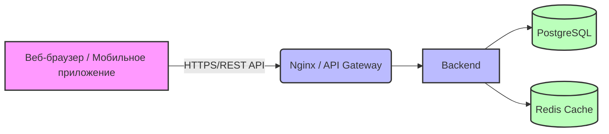
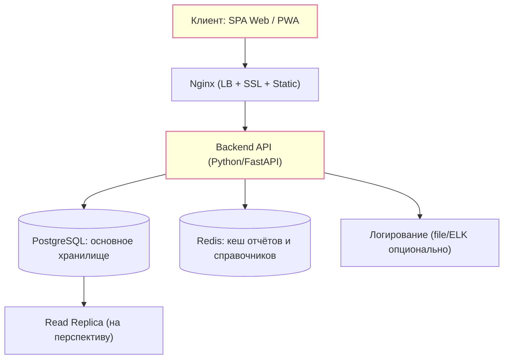
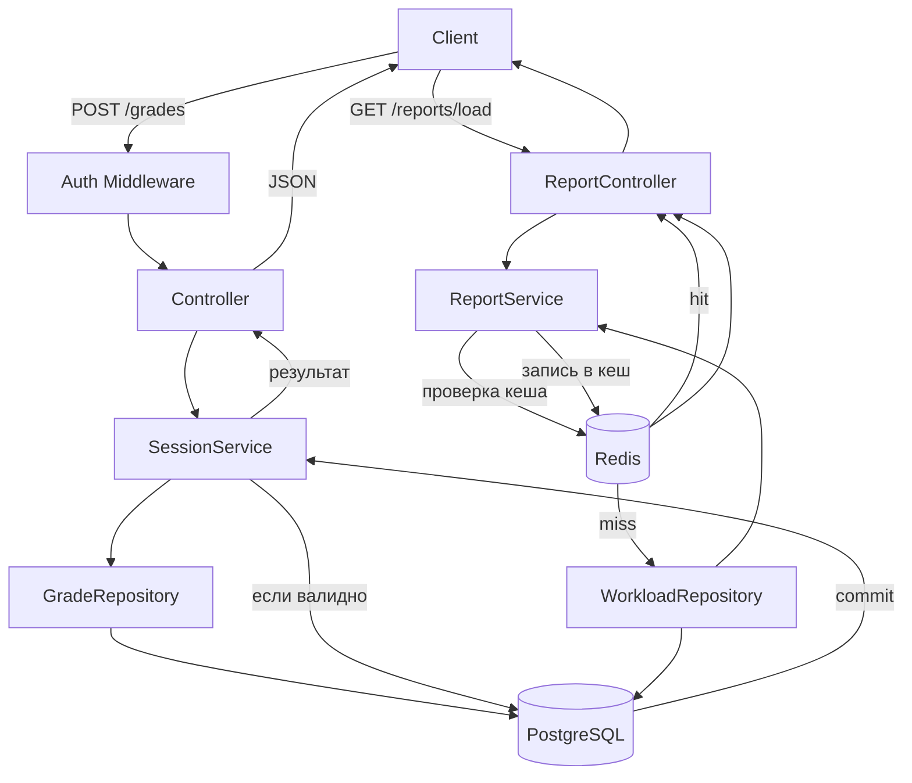

# Лабораторная работа №8. Проектирование архитектуры информационной системы вуза

## Раздел 1 — Выбор архитектурного стиля

**Выбранный стиль:** Клиент–сервер (трёхзвенная веб-архитектура)

**Верхнеуровневая схема:**


```
Веб-браузер/Мобильное приложение
|
| HTTPS/REST
|
Nginx/API
|
Backend
|
PostgreSQL и Redis Cache
```

**Обоснование:**
**Почему подходит:** Предметная область предполагает несколько ролей (студенты, преподаватели, деканат, администрация), которым нужен единый источник истины. Клиент–сервер позволяет вынести бизнес-логику (расчёт нагрузки, проверка категорий преподавателей, валидация сессий) на сервер, а клиентам отдавать только UI и API. Это гарантирует консистентность данных при выполнении 13 типов аналитических запросов и транзакционных операций (ввод оценок, распределение нагрузки).
1. **Отказ от альтернатив:** 
   - *Монолит (десктоп/толстый клиент)*: отвергнут, т.к. вузу требуется кроссплатформенный доступ, централизованные обновления и поддержка мобильных устройств. Толстые клиенты создадут проблемы с синхронизацией расписания и оценок.
   - *Микросервисы*: отвергнуты, т.к. домен сильно связан (студент ↔ группа ↔ факультет ↔ кафедра ↔ преподаватель ↔ дисциплина ↔ нагрузка ↔ сессия ↔ ВКР). Разделение потребует распределённых транзакций, sagas и сложного мониторинга, что избыточно для команды разработки размером 1–3 человека и нагрузки < 50 RPS.
3. **Минусы и стратегии жизни с ними:** 
   - Единая точка отказа backend-приложения. *Митигация:* stateless-архитектура, health-checks, автоматический рестарт через systemd/docker, регулярные бэкапы БД.
   - Рост монолита усложняет деплой. *Митигация:* строгая модульная структура (Раздел 5), CI/CD пайплайн с автотестами.
4. **Условие перехода:** При DAU > 15 000, внедрении offline-режима в мобильных приложениях или необходимости независимого масштабирования модуля генерации отчётов в период сессии → выделение `report-service`, `schedule-service` и переход к микросервисной архитектуре с Event-Driven коммуникацией.

---

## Раздел 2 — Компоненты системы

**Детальная схема архитектуры:**


**Описание компонентов и обоснование:**

| Компонент | Что делает | Почему нужен именно здесь |
|-----------|------------|---------------------------|
| **Клиент (SPA)** | Отображает интерфейсы ролей, отправляет REST-запросы, кэширует статику | Студентам/преподавателям нужен доступ с любого устройства без установки. SPA обеспечивает реактивность при работе с таблицами сессий и нагрузкой. |
| **Backend API** | Принимает запросы, валидирует входные данные, выполняет бизнес-логику (расчёт часов, проверка категорий, агрегация отчётов) | Вся логика из `var 1.docx` (ассистент не читает лекции, профессор не ведёт лабы, проверка званий/степеней) должна исполняться централизованно, иначе возникнут аномалии данных. |
| **PostgreSQL** | Хранит сущности: студенты, группы, кафедры, преподаватели, учебные планы, поручения, оценки, ВКР | Данные строго реляционные, требуют JOIN-ов для 13 типов запросов. Нужны транзакции (ACID) при фиксации оценок и распределении нагрузки. |
| **Nginx** | Прокси, SSL-терминатор, балансировщик, отдача статики | Защищает API от прямых запросов, кэширует статику фронтенда, распределяет трафик при пиковых нагрузках в период сессии. |
| **Redis** | Кеш результатов тяжёлых отчётов (Запросы 1–3, 7–10), справочников кафедр/дисциплин | В период зачётной недели деканат и студенты многократно повторяют одинаковые SELECT-запросы. Без кеша БД будет перегружена. Кешируем только READ-операции, инвалидируем при изменении оценок/нагрузки. |

*Примечание:* Брокер сообщений не добавлен, т.к. в текущем сценарии все процессы синхронные (ввод оценки → мгновенное обновление ведомости; распределение нагрузки → транзакция). Асинхронность потребуется только при внедрении email-рассылок расписания или очереди генерации PDF-отчётов.

---

## Раздел 3 — Оценка нагрузки (с разделением Read/Write)

### Исходные данные (реалистичные для среднего вуза):

|Параметр|Значение|Обоснование|
|---|---|---|
|Студентов|~10 000|Типичный вуз, 4–5 факультетов|
|Преподавателей + адм.|~900|Кафедры + деканаты + руководство|
|Рабочих дней в году|~250|Учебный год + сессии + каникулы|

### 1. DAU (Daily Active Users) с разбивкой по ролям

| Роль          | Всего  | Активность                      | DAU                             |
| ------------- | ------ | ------------------------------- | ------------------------------- |
| Студенты      | 10 000 | 30% проверяют расписание/оценки | **3 000**                       |
| Преподаватели | 900    | 90% ведут нагрузку/оценки       | 810                             |
| Деканат/адм.  | 100    | ~100% в рабочие часы            | **100**                         |
| **Итого DAU** |        |                                 | **≈ 3 910 → округляем до 4000** |

### 2. Действия на пользователя в день (Read / Write)

| Роль              | Чтение (запросов/день)                       | Запись (запросов/день)                          | Примеры                                                                  |
| ----------------- | -------------------------------------------- | ----------------------------------------------- | ------------------------------------------------------------------------ |
| **Студент**       | 2,5 (расписание, оценки, отчёты, ВКР-статус) | 0,25 (загрузка файлов, профиль)                 | Просмотр ведомости ≠ изменение оценки                                    |
| **Преподаватель** | 4 (нагрузка, расписание, список групп)       | 8 (ввод оценок, подтверждение часов, рецензии)  | Ввод оценки = транзакция с валидацией правил                             |
| **Деканат**       | 2 (справочники, статистика)                  | 5 (распределение поручений, финализация сессий) | Назначение преподавателя на дисциплину = проверка категории + транзакция |

**Средневзвешенная нагрузка:**

- Читать: `(3000×1 + 810×4 + 100×2) ≈ 11000 / 4000 = 2.75` → **~3 read-запросов/DAU**
- Писать: `(3000×0,25 + 810×8 + 100×5) ≈ 7800 / 4000 ≈ 1.95` → **~2 write-запроса/DAU**

### 3. RPS (Requests Per Second) — раздельно

**За день:**

- Read: `4 000 × 5 = 20 000 запросов`
- Write: `4 000 × 2 = 8 000 запросов`

**Активные часы:** 8 часов = 28 800 секунд

| Тип       | Средний RPS             | Пиковый RPS (×3) | Характер нагрузки                     |
| --------- | ----------------------- | ---------------- | ------------------------------------- |
| **Read**  | `20 000 / 28 800 ≈ 0.7` | **~2.1 RPS**     | Лёгкие SELECT, часто с кешем          |
| **Write** | `8 000 / 28 800 ≈ 0.28` | **~0.9 RPS**     | Транзакции с валидацией, блокировками |

> 🔑 **Ключевой вывод**: 80% нагрузки — чтение, 20% — запись. Это определяет стратегию: агрессивное кеширование отчётов + строгая консистентность при записи.

### 4. Объём данных (с разделением)

| Тип                  | Размер                       | Расчёт            | Итого/день      | Итого/год                                                  |
| -------------------- | ---------------------------- | ----------------- | --------------- | ---------------------------------------------------------- |
| Read-ответ           | ~2.5 KB (сжатый JSON)        | `17 500 × 2.5 KB` | **43.75 MB**    | ~10.9 GB (Не храним)                                       |
| Write-запрос + аудит | ~5 KB (тело + лог изменений) | `7 000 × 5 KB`    | **35 MB**       | ~8.75 GB                                                   |
| **Всего**            |                              |                   | **~79 MB/день** | **~10 GB/год** + индексы/бэкапы → **~25 ГБ/год с запасом** |

### 5. Вывод по масштабированию

- **Read-нагрузка** (2.1 RPS пик): легко покрывается одним экземпляром API + Redis (TTL 5–15 мин для отчётов).
- **Write-нагрузка** (0.9 RPS пик): одна реплика PostgreSQL справляется с запасом, т.к. транзакции короткие (<50 мс) и редко конфликтуют (разные преподаватели → разные группы).
- ✅ **Горизонтальное масштабирование не требуется**. Достаточно:
    - Вертикального резерва (4 vCPU / 8 GB RAM)
    - Read-реплики БД — только если время отклика отчётов >1.5 сек в период сессии
    - Шардирование — при DAU > 15 000 или расширении на филиалы

---

## Раздел 4 — Выбор стека технологий

| Слой              | Что выбрано                 | Обоснование (под задачу)                                                                                                                                                                                                     | Альтернатива и причина отказа                                                                                                                                 |
| ----------------- | --------------------------- | ---------------------------------------------------------------------------------------------------------------------------------------------------------------------------------------------------------------------------- | ------------------------------------------------------------------------------------------------------------------------------------------------------------- |
| **Бэкенд**        | Python + FastAPI            | Поддерживает async I/O, встроенная валидация Pydantic критична для строгих правил из ТЗ (ассистент ≠ лекции, профессор ≠ лабы, проверка степеней/званий). Автоматическая генерация OpenAPI упрощает интеграцию с фронтендом. | Java/Spring Boot: избыточная сложность, тяжелый memory footprint для <5 RPS. Node.js/Express: слабая типизация без TS, сложнее валидировать доменные правила. |
| **База данных**   | PostgreSQL                  | Реляционная база данных имеет все удобства, связанные с хранениями данных в реляционной среде. Позволяет поддерживать JSON (В частности нужно для `StudyPlan`)                                                               | MySQL: Есть все те же удобные способности, но нет поддержки JSON.<br>MongoDB/NoSQL: непригодна для строго связанных сущностей с ACID-требованиями.            |
| **Фронтенд**      | Vue 3 + Vite + Element Plus | Компонентная модель удобна для дашбордов деканата, таблиц сессий и фильтров отчётов. Vite даёт быстрый HMR. Element Plus предоставляет готовые таблицы/пагинацию, экономя время.                                             | React: крутая кривая, тяжелее бандл для данного масштаба. Angular: overkill, сложная настройка для учебной ИС.                                                |
| **Дополнительно** | Redis 7                     | Кеширование результатов отчётов 1–3, 7–10 и справочников (кафедры, дисциплины, категории). Инвалидация по событиям `grade_updated`, `workload_assigned`.                                                                     | Memcached: нет поддержки структур данных (hashes, sorted sets), сложнее управлять TTL и инвалидацией.                                                         |

---

## Раздел 5 — Архитектура кода (Layered Architecture)

**Структура бэкенда:**
```
src/
├── api/              # Controllers (маршруты, валидация запросов, сериализация)
├── core/             # Конфиг, зависимости, DI-контейнер, middlewares (auth, logging)
├── models/           # SQLAlchemy ORM-модели (студенты, преподаватели, дисциплины, оценки и т.д.)
├── repositories/     # Доступ к БД (сырые SQL + SQLAlchemy queries)
├── services/         # Бизнес-логика (расчёт нагрузки, проверка категорий, агрегация сессий, ВКР)
├── schemas/          # Pydantic-схемы вход/выход
└── main.py           # Точка входа, инициализация FastAPI
```

**Потоки данных и ответственность слоёв:**
1. **Controller (`api/`)** → принимает HTTP-запрос, десериализует тело, проверяет роль/права (JWT), вызывает соответствующий `Service`.
2. **Service (`services/`)** → реализует правила из ТЗ: 
   - `WorkloadService`: проверяет категорию преподавателя перед назначением лекций/лаб.
   - `SessionService`: агрегирует оценки, формирует ведомости, блокирует повторную сдачу.
   - `ReportService`: формирует ответы на 13 типов запросов, применяет фильтры.
3. **Repository (`repositories/`)** → инкапсулирует SQL, возвращает ORM-объекты или dict. Использует `session` с явным `commit/rollback`.
4. **Models/DB** → отражают ER-диаграмму из предыдущих лабораторных. Связи `1:N`, `M:N`, наследование преподавателей (TPH/STI).

**Схема взаимодействия модулей:**


**Модульное деление (по доменным контекстам):**
- `auth` (роли, JWT, права доступа к ведомостям)
- `academic` (факультеты, кафедры, учебные планы, дисциплины)
- `staff` (преподаватели, категории, степени, аспирантура)
- `workflow` (поручения деканата, распределение нагрузки, контроль категорий)
- `grading` (зачёты, экзамены, сессии, ведомости)
- `thesis` (руководство ВКР, привязка к факультету/кафедре)
- `reports` (13 типов запросов, агрегация, экспорт)
