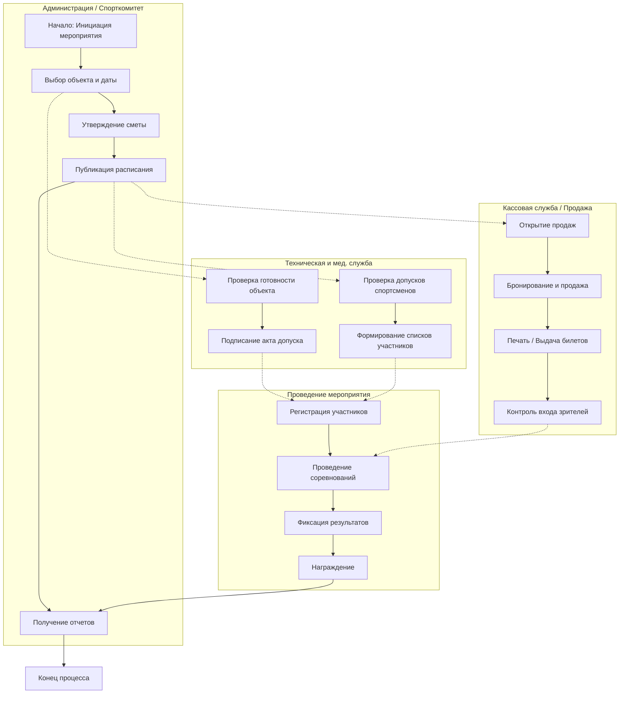
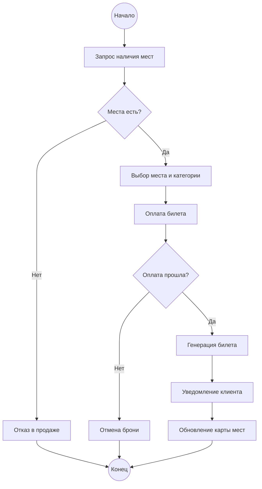

```markdown
# Лабораторная работа №3 – Бизнес-процессы предметной области (AS-IS)

**Тема:** Проектирование информационной системы спортивных организаций города.

---

## Задание №1. Формализация бизнес-процессов

Ниже приведено описание ключевого и вспомогательных бизнес-процессов предметной области в текущем состоянии (AS-IS).

### 1. Основной процесс: Организация и проведение спортивного мероприятия

| Параметр | Описание |
| --- | --- |
| **Название** | Организация и проведение спортивного мероприятия |
| **Цель процесса** | Успешное планирование, подготовка и проведение соревнования с обеспечением безопасности участников и зрителей |
| **Инициатор** | Руководитель спортивной организации / Спорткомитет города |
| **Входные данные** | Заявка на проведение, календарный план, данные о доступности объектов, бюджет мероприятия |
| **Выходные данные** | Утвержденное расписание, списки участников, проданные билеты, протокол результатов, отчетность |
| **Участники** | Администрация, тренеры, техническая служба, медицинская служба, кассиры, спортсмены, зрители |
| **Ожидаемый результат** | Мероприятие проведено, результаты зафиксированы, финансовые обязательства исполнены |

### 2. Вспомогательный процесс 1: Медицинский осмотр и допуск спортсмена

| Параметр | Описание |
| --- | --- |
| **Название** | Медицинский осмотр и допуск спортсмена |
| **Цель процесса** | Подтверждение физической готовности спортсмена к участию в соревнованиях |
| **Инициатор** | Спортсмен / Тренер |
| **Входные данные** | Личные данные спортсмена, история болезней, направление на осмотр |
| **Выходные данные** | Медицинская справка, статус допуска (разрешено/запрещено), запись в журнал учета |
| **Участники** | Врач спортивной медицины, спортсмен, администратор организации |
| **Ожидаемый результат** | Спортсмен допущен или отстранен от соревнований на основании состояния здоровья |

### 3. Вспомогательный процесс 2: Продажа и бронирование билетов

| Параметр | Описание |
| --- | --- |
| **Название** | Продажа и бронирование билетов |
| **Цель процесса** | Обеспечение доступа зрителей на мероприятие и сбор средств |
| **Инициатор** | Зритель / Болельщик |
| **Входные данные** | Информация о мероприятии, схема мест, платежные данные |
| **Выходные данные** | Билет (электронный/бумажный), чек, обновленная карта занятых мест |
| **Участники** | Кассир, зритель, банковская система, администратор арены |
| **Ожидаемый результат** | Место забронировано/куплено, зритель уведомлен, деньги поступили на счет |

---

## Задание №2. BPMN-диаграммы процессов

### 2.1. Диаграмма основного процесса (Организация и проведение мероприятия)

Ниже представлена схема основного процесса в нотации, приближенной к BPMN (использован синтаксис Mermaid для визуализации).



### 2.2. Диаграмма вложенного процесса (Продажа и бронирование билетов)

Данный процесс является частью основного процесса (блок «Кассовая служба / Продажа»).



---

## Задание №3. Анализ проблем основного процесса (AS-IS)

В таблице приведены выявленные проблемы текущего состояния бизнес-процессов до внедрения единой информационной системы.

| Возможная проблема | Причина | Последствие |
| --- | --- | --- |
| **Двойное бронирование объектов** | Отсутствие единого календаря занятости спортсооружений в реальном времени | Конфликты расписания, переносы мероприятий, недовольство организаторов |
| **Допуск спортсменов с просроченным медосмотром** | Разрозненный учет медицинских справок (бумажный журнал или локальные файлы) | Риск для здоровья спортсменов, штрафы от контролирующих органов, отмена результатов |
| **Ошибки при продаже билетов (овербукинг)** | Отсутствие синхронизации между кассами и онлайн-сервисом бронирования | Конфликты на входе, необходимость возврата денег, репутационные потери |
| **Задержка в формировании протоколов** | Ручной ввод результатов соревнований секретарями в таблицы | Несвоевременное награждение, задержка публикации новостей, ошибки в статистике |
| **Дублирование ввода данных о сотрудниках** | Кадровая служба и тренеры ведут свои списки контактов и нагрузок | Противоречивые данные, лишняя нагрузка на персонал, ошибки в начислении ставок |
| **Утеря данных о техническом состоянии объектов** | Журналы техосмотров ведутся на бумаге и не анализируются | Выход из строя инвентаря во время игр, риск травматизма, внеплановые расходы на ремонт |
| **Сложность сбора отчетности для Спорткомитета** | Данные разбросаны по разным организациям и форматам (Excel, бумага) | Длительное время подготовки сводных отчетов, высокая вероятность ошибок в цифрах |
| **Отсутствие истории взаимодействий со зрителями** | Нет единой базы покупателей билетов | Невозможность проведения маркетинговых акций, анализа лояльности и заполняемости |

---
